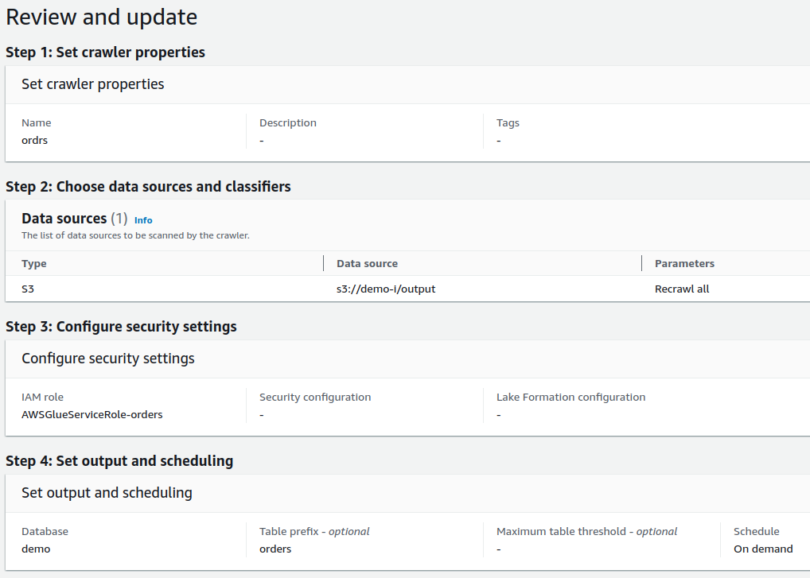
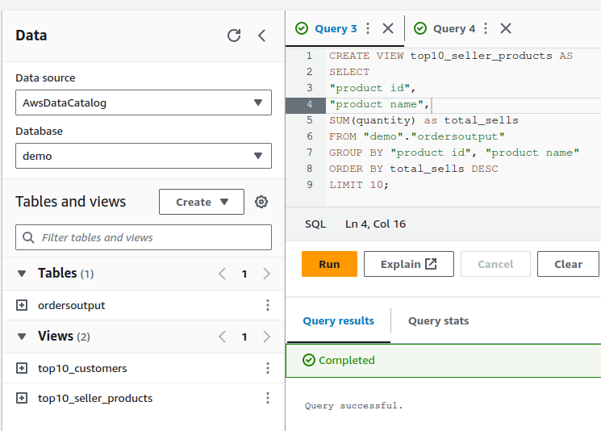
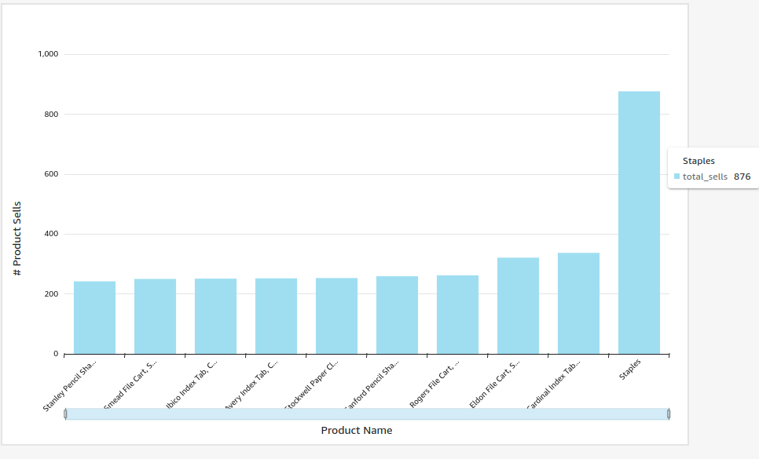
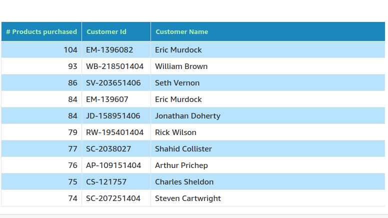

# Test DT

[TOC]

## Folder Structure
In this repository we will see, this folders:

- /aws/athena: SQL Queries used in Athena
- /aws/glue: Crawler and ETL Resources
- /aws/insight: Reports generates by Insight
- /aws/lambda: Lambda Functions
- /aws/step-functions: Workflow used in this project

# Data Engineer Practical Test

**Objective:**

Your task is to design and implement a data pipeline on AWS that ingests, processes, and stores data from a simulated e-commerce website. The pipeline should demonstrate best practices for scalability, reliability, and cost-efficiency.

**Requirements:**

See all details using this [Test](https://www.notion.so/okboyapp/Data-Engineer-Practical-Test-d65193310d3b49639fb3582473023151?pvs=4)

**Deliverables:**

1. Code/scripts for implementing the data pipeline.
2. Configuration files or infrastructure-as-code templates for setting up AWS resources.
3. Documentation covering the architecture, design decisions, and deployment instructions.

**Note:** Feel free to make assumptions or modifications as needed, and focus on demonstrating your expertise in designing and implementing scalable, reliable, and cost-effective data pipelines on AWS.

# Solution

# Design

Let's explain the design, in this section we will explain the details about the implementation.

## Process

### Flow to download GS File, ETL and generating Data Catalog tables.

To do this possible we did this in 3 steps, Downlod, Process(ETL) and Generate table in Data Catlog, to do this we will use **Step Functions**# Test DT

[TOC]

## Folder Structure
In this repository we will see, this folders:

- /aws/athena: SQL Queries used in Athena
- /aws/glue: Crawler and ETL Resources
- /aws/insight: Reports generates by Insight
- /aws/lambda: Lambda Functions
- /aws/step-functions: Workflow used in this project

# Data Engineer Practical Test

**Objective:**

Your task is to design and implement a data pipeline on AWS that ingests, processes, and stores data from a simulated e-commerce website. The pipeline should demonstrate best practices for scalability, reliability, and cost-efficiency.

**Requirements:**

See all details using this [Test](https://www.notion.so/okboyapp/Data-Engineer-Practical-Test-d65193310d3b49639fb3582473023151?pvs=4)

**Deliverables:**

1. Code/scripts for implementing the data pipeline.
2. Configuration files or infrastructure-as-code templates for setting up AWS resources.
3. Documentation covering the architecture, design decisions, and deployment instructions.

**Note:** Feel free to make assumptions or modifications as needed, and focus on demonstrating your expertise in designing and implementing scalable, reliable, and cost-effective data pipelines on AWS.

# Solución

# Diseño

Vamos a explicar la imagen  un poco, para ver los detalles en el diagrama.

## Proceso

### Flujo de Trabajo para descargar, procesar y cargar datos de GS a Data Catalog

Para lograr la ejecución de la descarga, preprocesamiento y generación de datos en data catalog usaremos **Step Functions**, in step function we can execute this steps in a workflow.

JSON wiht the Step Definition is located in the folder: **aws/step-functions**

**NOTE ** Here we will use Glue and S3, so the IAM role used to execute the Step Function must have premissions to use S3 and Amazon Glue.

Now it's time to explain every step of the procedure.

**Download file from GS to S3** 

To download the file from Google Storage to AWS S3 we will use Amazon Lambda Function, the logic in the lambda function will be:

- Download the file from GS to S3
- Upload the file to AWS S3

We used SAM to generate the lambda function, besause SAM will the responsable to create all necesary resources in AWS.

The lambda function code is in the folder: **aws/lambda**

**TODO**: We can improve this to receive the file indentifier like a parameter so the function can be more flexible.

**CSV Processing with ETL GLUE**

Once we have the CSV file in S3, now we can create an ETL to do some process to the data, we used **Amazon Glue Studio** to do this, logic of the ETL:

- Read the S3 file from S3.
- Apply a mapping to the dataset to convert from String columns to Int for example.
- Save the result on S3, we will use this to generate the Data Catalog Table in next steps.

The ETL Definition is in this folder **aws/glue/etl**

**Generating Data CAtlog using Crawler(AWS Glue)**

Using the preprocess data form the last step, now we will create a Crawler to fetch dta from S3 and Generate the Table in the Data Catalog, this table will be used after in Athena to some analysis.

- **Crawler definition**

- **Table in Data Catalog**

### Analysis in Athena

Now we have tables on Athena, so now we can start to do some analsys con the dataset.

The data set has orders data, so in our case we will generate 2 views.

- Top 10 best seller products(top10_seller_products)
- Top 10 best customers (top10_customers)

SQL Queries are in: **aws/athena**

**TODO:** Here we can create a lot of views such as: total sales, profits, and sales per branch, products out of stock to make decisions.

### **Report**

Now we are going to use these views to show them in a report, for this we will use [**AWS Insights](https://aws.amazon.com/blogs/aws-insights/).**

Since we already have the views, what we will do is generate a report to graphically see the data of the views.

**Best seller products report**

**Best customers report**

# **Conclusion**

This is the solution and implementation that I propose, using SAM, Glue and S3, we have a highly scalable product since they can be used to process little and a lot of information, S3 is very cheap and not to mention availability, it is the flagship data lake of AWS.

As for Glue, it can be used in a distributed manner, so if there is a lot of data it is flexible and more workers and resources can be assigned to it if necessary.

And SAM for lambda because it helps us generate everything through code.

Maybe it was missing to add in SNS to receive notifications if required but using eventbridge it could be added to the flow to receive notifications, for now Cloud Watch is enough for monitoring 🙂.

