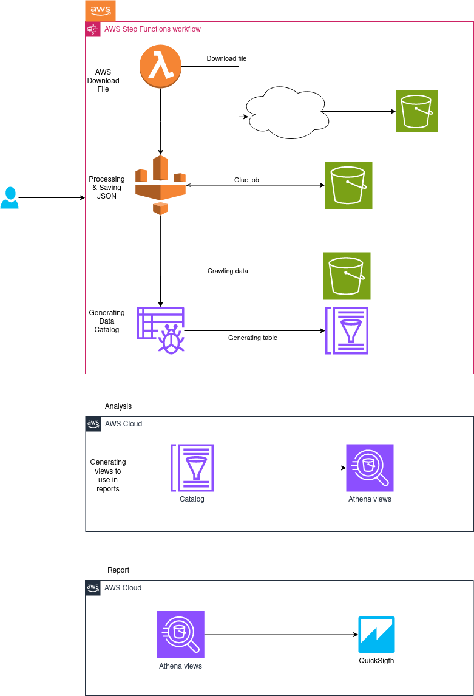
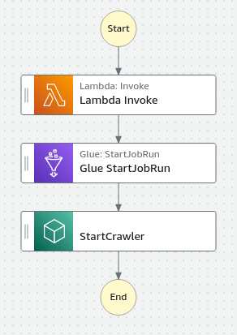
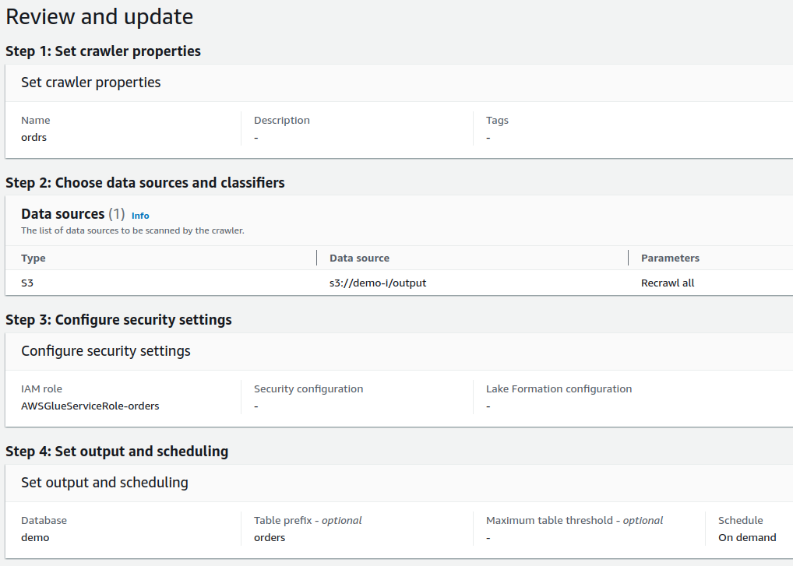
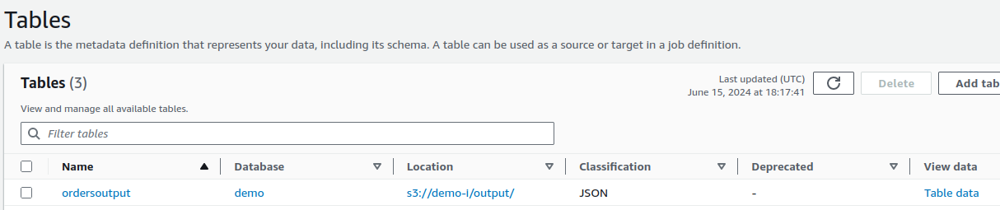
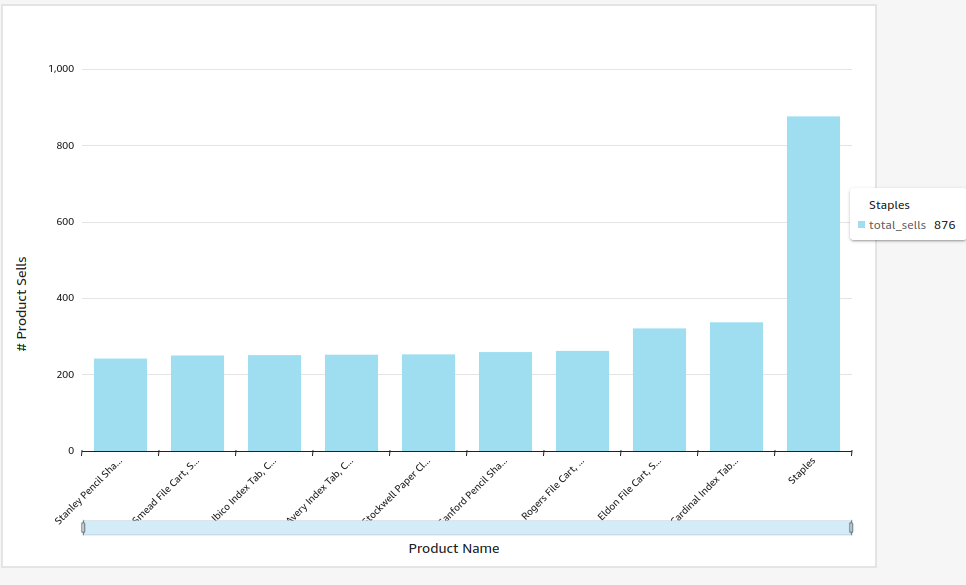
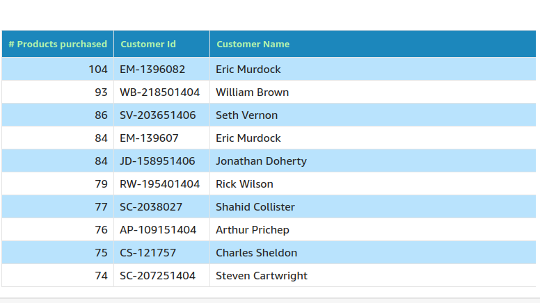

# Test DT

[TOC]

**NOTE:** [English version of the README](README.en.md)

## Folder Structure
In this repository we will see, this folders:

- /aws/athena: SQL Queries used in Athena
- /aws/glue: Crawler and ETL Resources
- /aws/insight: Reports generates by Insight
- /aws/lambda: Lambda Functions
- /aws/step-functions: Workflow used in this project

# Data Engineer Practical Test

**Objective:**

Your task is to design and implement a data pipeline on AWS that ingests, processes, and stores data from a simulated e-commerce website. The pipeline should demonstrate best practices for scalability, reliability, and cost-efficiency.

**Requirements:**

See all details using this [Test](https://www.notion.so/okboyapp/Data-Engineer-Practical-Test-d65193310d3b49639fb3582473023151?pvs=4)

**Deliverables:**

1. Code/scripts for implementing the data pipeline.
2. Configuration files or infrastructure-as-code templates for setting up AWS resources.
3. Documentation covering the architecture, design decisions, and deployment instructions.

**Note:** Feel free to make assumptions or modifications as needed, and focus on demonstrating your expertise in designing and implementing scalable, reliable, and cost-effective data pipelines on AWS.

# Solución

# Diseño

Vamos a explicar la imagen  un poco, para ver los detalles en el diagrama.

## Proceso

### Flujo de Trabajo para descargar, procesar y cargar datos de GS a Data Catalog

Para lograr la ejecución de la descarga, preprocesamiento y generación de datos en data catalog usaremos **Step Functions**, para ejecutar estos 3 subprocesos.

JSON con la definición del Step Funtion está en: **aws/step-functions**

**NOTA:** Acá como usamos Glue y S3 hay que asegurarse que el role que ejecuta este flujo tenga acceso a esos servicios.

A continuación explicamos cada procedimiento.

**Descargar archivo de GS a S3** 

Para descargar el archivo de Google Storage a AWS S3 vamos a ulitizar una función lambda, la función lambda realizará lo siguiente:

- Decargar el archivo CSV
- Subir archivo a un bucket de S3

Esto se logra con la siguiente función lambda usando SAM para generar la insfraestuctura necesaria en AWS.

La función lambda usada se puede encontrar en: **aws/lambda**

**TODO**: Acá podemos parametrizar esta función para recibir sólo el identificador del archivo para hacer esta función más flexible.

**CSV Processing with ETL con GLUE**

Una vez que tengamos el archivo CSV en S3, ahora vamos a crear un ETL usando **Amazon Glue**, en este job vamos a realizar las siguientes operaciones:

- Leer el archivo de S3(Ruta donde descargamos el archivo de GS previamente)
- Hacer un mapeo para cambiar de tipo algunas columnas del CSV de String a Int por ejemplo en algunas columnas.
    - **NOTE**: Acá podemos realizar más operaciones, en caso de que nuestro archivo necesite más tratamiento, en nuestro caso sólo vamos a realizar un mapeo.
- Guardamos el resultado en S3 en una ubicación especifica.

Este json es la definición del ETL de Glue.

La función lambda usada se puede encontrar en: **aws/glue/etl**

**Crawler para generar Data Catalog**

Ahora que ya hicimos un preprocesamiento sobre los datos, lo siguiente será a usar el resultado del preprocesamiento para generar una base de datos y la tabla en data catalog.

Para lograr esto vamos a crear un **Crawler** usando **Amazon Glue,** el objetivo del crawler es leer datos en S3 y en base a ello generar la data en Data Catlog.

- **Crawler definition**

- **Resultado en Data Catalog**

### Análisis en Athena

Ahora que ya tenemos los datos en Data Catalog, ya podemos empezar a analizar los datos.

En nuestro caso vamos a crear vistas para mostrar lo siguiente:

- Productos que más se venden(top10_seller_products)
- Clientes que más compran(top10_customers)

Las consultas SQL que se usaorn en Ethan están en: **aws/athena**

**TODO:** Acá podemos generar más estadisticas como total de ventas, ganancias, y ventas por sucursal, productos sin stock para tomar desiciones, pero por ahora sólo se generaron las 2 vistas listadas previamente.

### **Reporte**

Ahora vamos a usar estas vistas para mostrarlos en un reporte, para ello usaremos [**AWS Insights](https://aws.amazon.com/blogs/aws-insights/).**

Como ya tenemos las vistas lo que haremos será generar un reporte para ver graficamente los datos de las vistas.

**Reporte productos más vendidos**

**Reporte clientes que más compran**

# **Conclusión**

Este es la solución e implementación que propongo, usando SAM, Glue y S3, tenemos un producto altamente escalable ya que se pueden usar para procesar poca y mucha información, S3 es muy barato y no se diga de la disponibilidad es el data lake insignia de AWS.

En cuanto a Glue se puede usar de manera distribuida por lo que si fueran muchos datos es flexible y se le pueden asignar mas worker y recursos si fuera necesario.

Y SAM para lambda porque nos ayuda a generar todo mediante código.

Quizas faltó agregar in SNS para recibir notificaciones en caso de que se requiere pero usando eventbridge se pudiera agregar al flujo para recibir notificaciones, por ahora basta con Cloud Watch para el monitoreo 🙂.